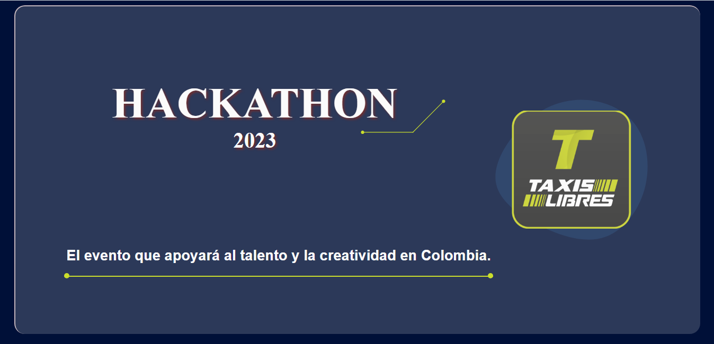
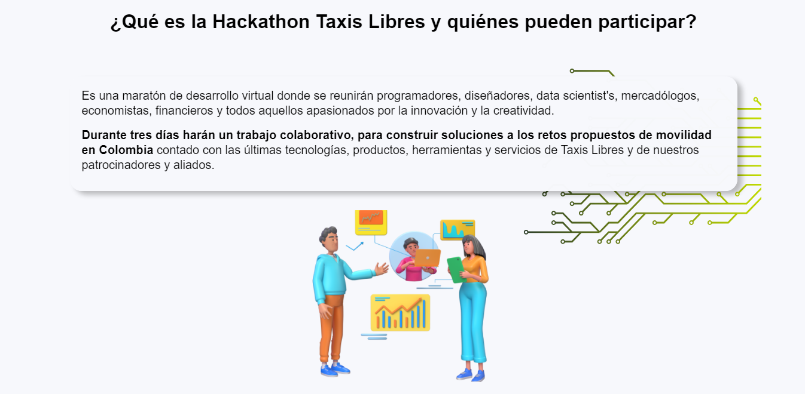
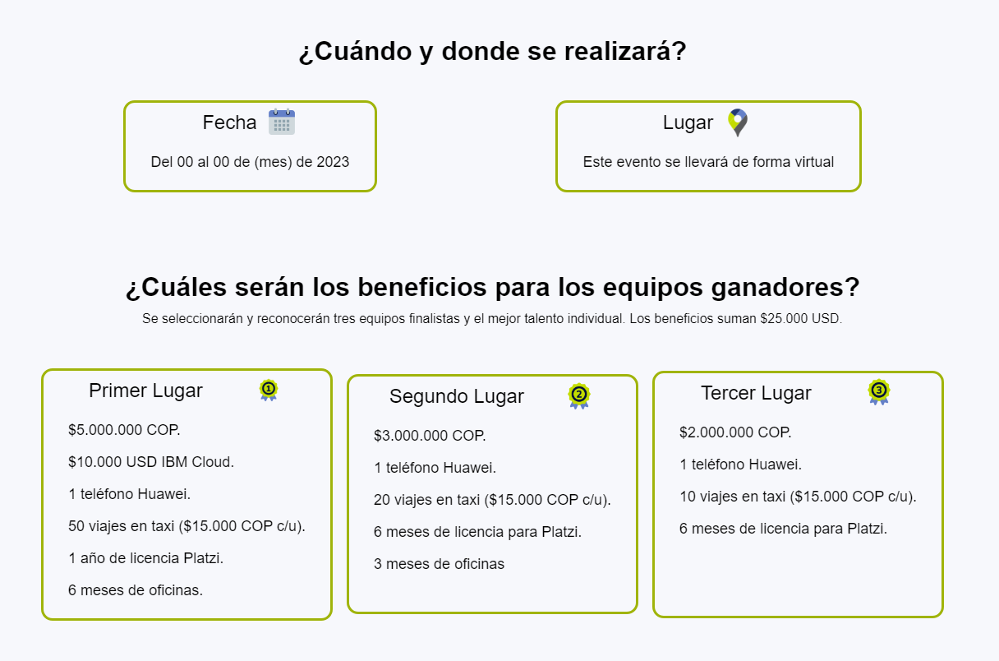
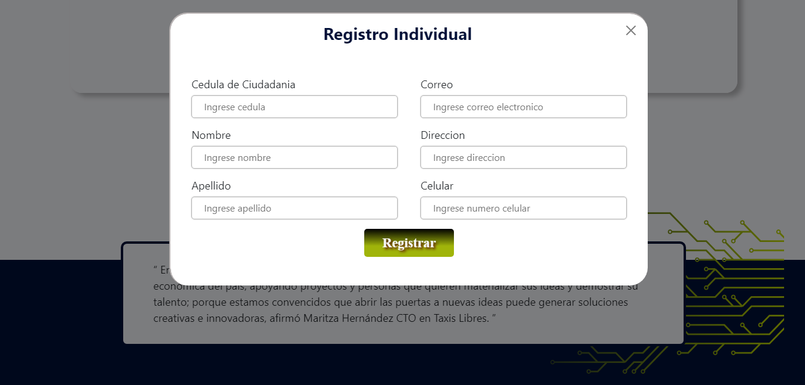

# Prueba-taxis-libres.

Consiste en la creación de una landing page donde mencionamos que es, cuando es, dónde es, cual es el objetivo, premios, patrocinadores oficiales y el formulario de inscripción de los participantes a nivel mundial. 

El reto consiste en crear la landing del evento "Hackathon 2023" con los temas anteriormente mencionados.

`<link>` : <https://fernandezjuandiego95.github.io/prueba-taxis-libres.github.io/>

### Imagenes del resultado.

